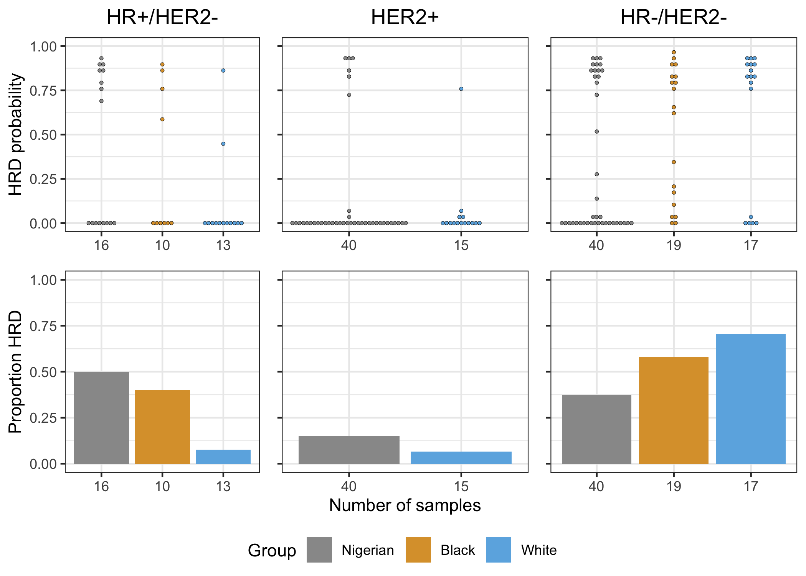

HRD Analysis
================

## HRD prediction vs mutation:

### Nigerian

<!-- -->

### TCGA

<!-- -->

## HRD score by subtype:

<!-- -->

## SVs by subtype:

<!-- -->

## Summary of CHORD output:

### Nigerian

| Sample  | Subtype   | Mutation | CHORD HRD Score | CHORD HR Status | CHORD HRD Type       |
| :------ | :-------- | :------- | --------------: | :-------------- | :------------------- |
| N011028 | HR-/HER2- |          |           0.938 | Deficient       | BRCA1                |
| L000182 | HR-/HER2- |          |           0.936 | Deficient       | BRCA1                |
| N010942 | HER2+     |          |           0.934 | Deficient       | BRCA1                |
| N011040 | HR-/HER2- |          |           0.926 | Deficient       | BRCA1                |
| N011082 | HR+/HER2- |          |           0.926 | Deficient       | BRCA1                |
| L000153 | HER2+     | BRCA1    |           0.922 | Deficient       | BRCA1                |
| L000077 | HER2+     | BRCA1    |           0.916 | Deficient       | BRCA1                |
| N009902 | HR+/HER2- | BRCA1    |           0.910 | Deficient       | BRCA1                |
| N009973 | HR+/HER2- |          |           0.906 | Deficient       | BRCA1                |
| N010282 | HR-/HER2- |          |           0.904 | Deficient       | BRCA1                |
| N009905 | HR-/HER2- |          |           0.898 | Deficient       | BRCA1                |
| N010858 | HR-/HER2- | BRCA2    |           0.890 | Deficient       | BRCA2                |
| N011005 | HR-/HER2- |          |           0.878 | Deficient       | BRCA1                |
| N010917 | HR+/HER2- | BRCA1    |           0.872 | Deficient       | BRCA1                |
| N010822 | HR-/HER2- |          |           0.870 | Deficient       | BRCA1                |
| N010828 | HR+/HER2- |          |           0.866 | Deficient       | BRCA1                |
| N010868 | HR-/HER2- | BRCA2    |           0.862 | Deficient       | BRCA2                |
| N010755 |           | BRCA2    |           0.852 | Deficient       | BRCA2                |
| L000178 | HER2+     | PALB2    |           0.850 | Deficient       | BRCA2                |
| N010149 | HR-/HER2- | BRCA2    |           0.846 | Deficient       | BRCA2                |
| N010931 | HR-/HER2- | BRCA2    |           0.830 | Deficient       | BRCA2                |
| N010867 | HER2+     | BRCA2    |           0.820 | Deficient       | BRCA2                |
| N010926 | HR-/HER2- |          |           0.812 | Deficient       | BRCA1                |
| L000083 | HR-/HER2- | BRCA2    |           0.784 | Deficient       | BRCA2                |
| N010117 | HR+/HER2- |          |           0.782 | Deficient       | BRCA2                |
| N010106 | HR+/HER2- | PALB2    |           0.768 | Deficient       | BRCA2                |
| L000185 | HR-/HER2- |          |           0.740 | Deficient       | BRCA1                |
| L000024 | HER2+     |          |           0.720 | Deficient       | BRCA1                |
| N011018 | HR+/HER2- |          |           0.690 | Deficient       | BRCA2                |
| N009975 |           |          |           0.606 | Deficient       | Cannot be determined |
| N010862 | HR-/HER2- |          |           0.528 | Deficient       | BRCA2                |
| N009932 |           | PALB2    |           0.294 | Proficient      |                      |
| N010835 | HR-/HER2- |          |           0.270 | Proficient      |                      |
| N011047 | HR-/HER2- |          |           0.134 | Proficient      |                      |
| N010830 | HER2+     |          |           0.082 | Proficient      |                      |
| N010678 | HR-/HER2- |          |           0.046 | Proficient      |                      |
| N010628 | HR-/HER2- |          |           0.032 | Proficient      |                      |
| L000006 | HR-/HER2- |          |           0.030 | Proficient      |                      |
| N010721 | HER2+     |          |           0.030 | Proficient      |                      |
| N010820 | HER2+     |          |           0.016 | Proficient      |                      |
| L000160 | HR-/HER2- |          |           0.010 | Proficient      |                      |
| N010912 | HER2+     |          |           0.010 | Proficient      |                      |
| N011013 | HR+/HER2- |          |           0.010 | Proficient      |                      |
| N010851 | HR-/HER2- |          |           0.004 | Proficient      |                      |
| N010870 | HR+/HER2- |          |           0.004 | Proficient      |                      |
| N010911 | HER2+     |          |           0.004 | Proficient      |                      |
| N011076 | HER2+     |          |           0.004 | Proficient      |                      |
| L000204 | HER2+     |          |           0.002 | Proficient      |                      |
| N010945 | HR-/HER2- |          |           0.002 | Proficient      |                      |
| N011074 | HER2+     |          |           0.002 | Proficient      |                      |
| L000009 | HR-/HER2- |          |           0.000 | Proficient      |                      |
| L000011 | HER2+     |          |           0.000 | Proficient      |                      |
| L000013 | HER2+     |          |           0.000 | Proficient      |                      |
| L000015 | HER2+     |          |           0.000 | Proficient      |                      |
| L000017 | HR-/HER2- |          |           0.000 | Proficient      |                      |
| L000020 | HER2+     |          |           0.000 | Proficient      |                      |
| L000060 | HER2+     |          |           0.000 | Proficient      |                      |
| L000063 | HR-/HER2- |          |           0.000 | Proficient      |                      |
| L000068 | HR-/HER2- |          |           0.000 | Proficient      |                      |
| L000101 | HER2+     |          |           0.000 | Proficient      |                      |
| L000177 | HR-/HER2- |          |           0.000 | Proficient      |                      |
| L000186 | HR-/HER2- |          |           0.000 | Proficient      |                      |
| N009836 | HER2+     |          |           0.000 | Proficient      |                      |
| N009908 | HER2+     |          |           0.000 | Proficient      |                      |
| N009936 | HER2+     |          |           0.000 | Proficient      |                      |
| N009946 | HER2+     |          |           0.000 | Proficient      |                      |
| N009974 | HER2+     |          |           0.000 | Proficient      |                      |
| N010274 | HR-/HER2- |          |           0.000 | Proficient      |                      |
| N010656 | HER2+     |          |           0.000 | Proficient      |                      |
| N010829 | HER2+     |          |           0.000 | Proficient      |                      |
| N010842 | HER2+     |          |           0.000 | Proficient      |                      |
| N010852 | HR-/HER2- |          |           0.000 | Proficient      |                      |
| N010877 | HER2+     |          |           0.000 | Proficient      |                      |
| N010891 | HR+/HER2- |          |           0.000 | Proficient      |                      |
| N010909 | HR-/HER2- |          |           0.000 | Proficient      |                      |
| N010914 | HR-/HER2- |          |           0.000 | Proficient      |                      |
| N010929 | HER2+     |          |           0.000 | Proficient      |                      |
| N010936 |           |          |           0.000 | Proficient      |                      |
| N010939 | HR-/HER2- |          |           0.000 | Proficient      |                      |
| N010940 | HR+/HER2- |          |           0.000 | Proficient      |                      |
| N010946 | HER2+     |          |           0.000 | Proficient      |                      |
| N010952 | HR-/HER2- |          |           0.000 | Proficient      |                      |
| N010959 | HR-/HER2- |          |           0.000 | Proficient      |                      |
| N010964 | HR+/HER2- |          |           0.000 | Proficient      |                      |
| N010970 | HER2+     |          |           0.000 | Proficient      |                      |
| N010985 | HER2+     |          |           0.000 | Proficient      |                      |
| N011001 | HER2+     |          |           0.000 | Proficient      |                      |
| N011002 | HER2+     |          |           0.000 | Proficient      |                      |
| N011003 | HR-/HER2- |          |           0.000 | Proficient      |                      |
| N011006 | HR+/HER2- |          |           0.000 | Proficient      |                      |
| N011012 | HR+/HER2- |          |           0.000 | Proficient      |                      |
| N011017 | HER2+     |          |           0.000 | Proficient      |                      |
| N011022 | HR-/HER2- |          |           0.000 | Proficient      |                      |
| N011037 | HER2+     |          |           0.000 | Proficient      |                      |
| N011038 | HR-/HER2- |          |           0.000 | Proficient      |                      |
| N011049 | HER2+     |          |           0.000 | Proficient      |                      |
| N011050 | HR-/HER2- |          |           0.000 | Proficient      |                      |
| N011056 | HER2+     |          |           0.000 | Proficient      |                      |
| N011070 | HER2+     |          |           0.000 | Proficient      |                      |
| N011072 | HR+/HER2- |          |           0.000 | Proficient      |                      |

### TCGA

| Sample       | Subtype   | Mutation | CHORD HRD Score | CHORD HR Status | CHORD HRD Type       |
| :----------- | :-------- | :------- | --------------: | :-------------- | :------------------- |
| TCGA-EW-A3U0 | HR-/HER2- |          |           0.954 | Deficient       | BRCA1                |
| TCGA-GI-A2C9 | HR-/HER2- |          |           0.948 | Deficient       | BRCA1                |
| TCGA-AO-A124 | HR-/HER2- | BRCA1    |           0.944 | Deficient       | BRCA1                |
| TCGA-BH-A0WA | HR-/HER2- | BRCA1    |           0.938 | Deficient       | BRCA1                |
| TCGA-AN-A04D | HR-/HER2- |          |           0.920 | Deficient       | BRCA2                |
| TCGA-C8-A12L |           |          |           0.914 | Deficient       | BRCA1                |
| TCGA-A2-A0D0 | HR-/HER2- |          |           0.910 | Deficient       | BRCA1                |
| TCGA-BH-A0AV | HR-/HER2- |          |           0.910 | Deficient       | BRCA1                |
| TCGA-AN-A0AT | HR-/HER2- |          |           0.908 | Deficient       | BRCA1                |
| TCGA-A2-A25B | HR+/HER2- | BRCA1    |           0.906 | Deficient       | BRCA1                |
| TCGA-D8-A27H | HR-/HER2- |          |           0.902 | Deficient       | BRCA1                |
| TCGA-A2-A04T | HR-/HER2- |          |           0.896 | Deficient       | BRCA1                |
| TCGA-A2-A3Y0 | HR+/HER2- |          |           0.862 | Deficient       | BRCA2                |
| TCGA-A8-A08L | HR+/HER2- | BRCA2    |           0.852 | Deficient       | BRCA2                |
| TCGA-A7-A0CE | HR-/HER2- |          |           0.850 | Deficient       | BRCA2                |
| TCGA-AO-A0J4 | HR-/HER2- |          |           0.830 | Deficient       | BRCA1                |
| TCGA-BH-A0B3 | HR-/HER2- |          |           0.824 | Deficient       | BRCA1                |
| TCGA-AR-A256 | HR-/HER2- |          |           0.820 | Deficient       | BRCA2                |
| TCGA-GM-A3XL | HR-/HER2- |          |           0.818 | Deficient       | BRCA1                |
| TCGA-B6-A0RT | HR-/HER2- |          |           0.812 | Deficient       | Cannot be determined |
| TCGA-EW-A1PB | HR-/HER2- |          |           0.804 | Deficient       | BRCA1                |
| TCGA-A2-A04P | HR-/HER2- |          |           0.802 | Deficient       | BRCA2                |
| TCGA-AO-A0J6 | HR-/HER2- |          |           0.778 | Deficient       | BRCA2                |
| TCGA-A8-A075 | HER2+     |          |           0.772 | Deficient       | BRCA2                |
| TCGA-AQ-A04J | HR-/HER2- |          |           0.772 | Deficient       | BRCA2                |
| TCGA-A7-A13D | HR+/HER2- |          |           0.766 | Deficient       | BRCA2                |
| TCGA-BH-A0BW | HR-/HER2- |          |           0.760 | Deficient       | BRCA2                |
| TCGA-GM-A2DF | HR-/HER2- |          |           0.662 | Deficient       | BRCA2                |
| TCGA-E2-A1LG | HR-/HER2- |          |           0.626 | Deficient       | BRCA2                |
| TCGA-A2-A04X |           |          |           0.624 | Deficient       | BRCA2                |
| TCGA-AO-A12H | HR+/HER2- |          |           0.602 | Deficient       | Cannot be determined |
| TCGA-BH-A0DT | HR+/HER2- |          |           0.464 | Proficient      |                      |
| TCGA-A7-A26G | HR-/HER2- |          |           0.338 | Proficient      |                      |
| TCGA-AO-A03L |           |          |           0.292 | Proficient      |                      |
| TCGA-B6-A0RE |           |          |           0.206 | Proficient      |                      |
| TCGA-BH-A1FC | HR-/HER2- |          |           0.200 | Proficient      |                      |
| TCGA-B6-A0WX | HR-/HER2- |          |           0.162 | Proficient      |                      |
| TCGA-C8-A130 |           |          |           0.132 | Proficient      |                      |
| TCGA-AC-A2BK | HR-/HER2- |          |           0.094 | Proficient      |                      |
| TCGA-C8-A12Q |           |          |           0.052 | Proficient      |                      |
| TCGA-E2-A14P | HER2+     |          |           0.052 | Proficient      |                      |
| TCGA-AR-A1AY | HR-/HER2- |          |           0.038 | Proficient      |                      |
| TCGA-BH-A18U | HER2+     |          |           0.036 | Proficient      |                      |
| TCGA-A8-A09I | HER2+     |          |           0.034 | Proficient      |                      |
| TCGA-E2-A1LL | HR-/HER2- |          |           0.030 | Proficient      |                      |
| TCGA-A2-A3XX | HR-/HER2- |          |           0.022 | Proficient      |                      |
| TCGA-BH-A0E0 | HR-/HER2- |          |           0.012 | Proficient      |                      |
| TCGA-E2-A109 | HR+/HER2- |          |           0.008 | Proficient      |                      |
| TCGA-A2-A0EY | HER2+     |          |           0.004 | Proficient      |                      |
| TCGA-EW-A1PH |           |          |           0.004 | Proficient      |                      |
| TCGA-A8-A092 | HR+/HER2- |          |           0.002 | Proficient      |                      |
| TCGA-BH-A0DG | HR+/HER2- |          |           0.002 | Proficient      |                      |
| TCGA-E2-A14X | HR-/HER2- |          |           0.002 | Proficient      |                      |
| TCGA-E2-A15H | HER2+     |          |           0.002 | Proficient      |                      |
| TCGA-E9-A1NH | HR+/HER2- |          |           0.002 | Proficient      |                      |
| TCGA-EW-A1J5 |           |          |           0.002 | Proficient      |                      |
| TCGA-A2-A0D1 | HER2+     |          |           0.000 | Proficient      |                      |
| TCGA-A2-A0D4 | HR+/HER2- |          |           0.000 | Proficient      |                      |
| TCGA-A2-A0YG | HER2+     |          |           0.000 | Proficient      |                      |
| TCGA-A2-A259 | HR+/HER2- |          |           0.000 | Proficient      |                      |
| TCGA-A2-A3KC | HR+/HER2- |          |           0.000 | Proficient      |                      |
| TCGA-A8-A07B | HER2+     |          |           0.000 | Proficient      |                      |
| TCGA-A8-A07I | HER2+     |          |           0.000 | Proficient      |                      |
| TCGA-A8-A08S | HER2+     |          |           0.000 | Proficient      |                      |
| TCGA-A8-A09X | HR-/HER2- |          |           0.000 | Proficient      |                      |
| TCGA-AN-A0G0 | HR-/HER2- |          |           0.000 | Proficient      |                      |
| TCGA-AN-A0XR | HR+/HER2- |          |           0.000 | Proficient      |                      |
| TCGA-AO-A03N | HR+/HER2- |          |           0.000 | Proficient      |                      |
| TCGA-AO-A0JM |           |          |           0.000 | Proficient      |                      |
| TCGA-AR-A0TX | HER2+     |          |           0.000 | Proficient      |                      |
| TCGA-AR-A24Z | HR+/HER2- |          |           0.000 | Proficient      |                      |
| TCGA-AR-A2LK | HR+/HER2- |          |           0.000 | Proficient      |                      |
| TCGA-B6-A0I1 |           |          |           0.000 | Proficient      |                      |
| TCGA-B6-A0X5 | HR+/HER2- |          |           0.000 | Proficient      |                      |
| TCGA-BH-A0EA | HR+/HER2- |          |           0.000 | Proficient      |                      |
| TCGA-BH-A0H0 | HR+/HER2- |          |           0.000 | Proficient      |                      |
| TCGA-BH-A0H6 | HR+/HER2- |          |           0.000 | Proficient      |                      |
| TCGA-BH-A18R | HER2+     |          |           0.000 | Proficient      |                      |
| TCGA-E2-A152 | HER2+     |          |           0.000 | Proficient      |                      |
| TCGA-E2-A156 | HR+/HER2- |          |           0.000 | Proficient      |                      |
| TCGA-E2-A15E | HER2+     |          |           0.000 | Proficient      |                      |
| TCGA-E2-A1LK | HR-/HER2- |          |           0.000 | Proficient      |                      |
| TCGA-EW-A1P8 | HR-/HER2- |          |           0.000 | Proficient      |                      |
| TCGA-EW-A1PC | HR+/HER2- |          |           0.000 | Proficient      |                      |
